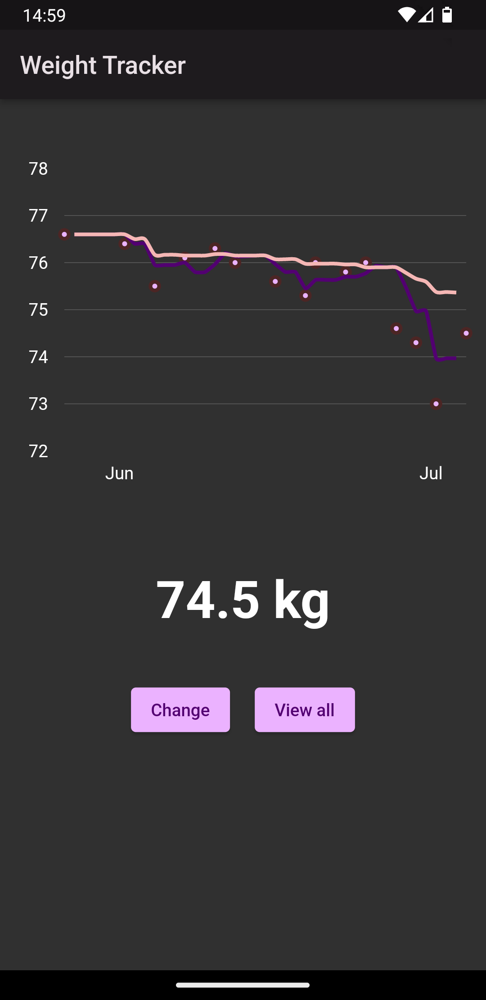

# Weight Tracker App

A simple Android app to track weight.

## Description

The whole idea of this was to have a maximally simple app to record weight.
The app can show floating (7-/30-day) averages to help filter the noise.

That's all folks.

## Screenshots

